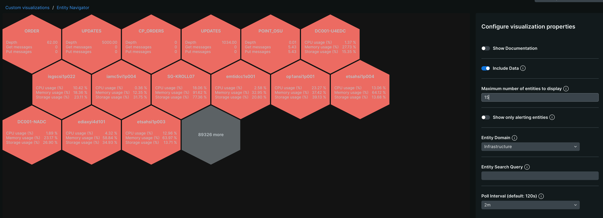

[](https://opensource.newrelic.com/oss-category/#new-relic-one-catalog-project)


# Labs Widget Pack


A library of New Relic custom chart widgets created by the New Relic Labs team, for use in New Relic dashboards.

To get started:
- [Review the set of widgets included in the pack](#widgets)
- [Enable the pack in your account](#enable)
- [Review how to get help](#help)

## Widgets <a id="widgets"></a>

Click on the short description in each section to view chart details.


### Line & Bar Chart

<details>

  <summary>Display changes in quantity alongside trends over time.</summary>

  <br/>

  

   #### Overview
  Use the Line & Bar chart to understand changes in quantity values (rendered as bars) alongside trends over time (rendered as lines). For instance, you may be interested in understanding how infrastructure load is impacted by throughput on your web site. Or you may want to see if web page response time effects the total number of orders processed - these are perfect use cases for a Line & Bar Chart.

  The Line & Bar chart plots data across three axes:
  - the X axis represents time
  - the left Y axis represents the values for the Bar Charts
  - the right Y axis represents the values for the Line Charts

  The chart allows you to define multiple line and bar queries, so it is highly recommended that the queries are aligned in terms of units and time periods.

  #### Requirements
  In order to use this chart, there are a few requirements:
  - You must provide at least 1 bar query and 1 time query
  - Each query must use the `TIMESERIES` clause, with the same bucket eg. `TIMESERIES 1 day`
  - If using the `SINCE` clause it is strongly recommended to be the same across all configured queries

  A valid bar query for the chart could look like this:
  `SELECT percentile(duration, 80) as 'Load' from PageView TIMESERIES 1 day since last week`

  A valid line query for the chart could look like this:
  `SELECT count(*) as 'Views' from PageView where TIMESERIES 1 day since last week`

  To include multiple lines and/or bars in the chart, you can either:
  - define additional queries following the guidelines above
  - include a `FACET` clause in your query. Note that if you are faceting on the same attribute in both the line and the bar queries, you will need to alias one of those facets in order to avoid name collisions in the chart output.
  ---
</details>

### Granular Timeseries Charts

<details>

  <summary>Perform timeseries queries above the default 366 bucket allowance.</summary>

  <!-- <br/> -->

  <!--  -->

   #### Overview
  Use the Granular Timeseries Chart to see longer periods of data in high granularity above the default 366 allowance.

  The Granular Timeseries Chart, supports Line, Area & Sparkline chart types.

  #### Requirements
  In order to use this chart, there are a few requirements:
  - Each query must use and end with the `TIMESERIES` clause, and also contain the bucket eg. `TIMESERIES 1 second`
  - Do not use SINCE or UNTIL clauses as they will automatically be determined based on the time range picker
  - If using the LIMIT clause, this should be placed before and not after the TIMESERIES clause
  - Be aware that with longer time ranges, the chart will need more time to load. Use of this chart is ideal for shorter ranges, such as 7 - 14 days.

  A valid query for the chart could look like this:
  `SELECT count(*) FROM Transaction FACET appName TIMESERIES 1 second`

  ---
</details>

###

### Cumulative Timeseries Chart

<details>

  <summary>Trend cumulative values over time as a line or area chart.</summary>

  

   #### Overview
   Use the Cumulative Chart to see running totals, or the total sum of a given data set as it grows with time.

   The Cumulative Timeseries chart supports Line & Area chart types.

  #### Requirements
  In order to use this chart, there are a few requirements:
  - Each query must use and end with the `TIMESERIES` clause, and also contain the bucket eg. `TIMESERIES 1 second`
  - Do not use SINCE or UNTIL clauses as they will automatically be determined based on the time range picker
  - If using the LIMIT clause, this should be placed before and not after the TIMESERIES clause

  A valid query for the chart could look like this:
  `SELECT count(*) FROM Transaction FACET appName TIMESERIES`

  ---
</details>

### Billboard & Line Chart

<details>

  <summary>Plot a single value and a timeseries in the same chart. e.g. Latest active alerts vs the trend of alerts</summary>

  
  ---
</details>

### Status Gauge Chart

<details>

  <summary>Display the distribution of a single value into a horizontal bar based on defined thresholds, in conjunction with an optional status table</summary>

  

  #### Requirements
  In order to use this chart, there are a few requirements:
  - Each query must return a single value result (only a single select value, no facet clauses)
  - An accountId, thresholds, and unit definition must be specified

  A valid query could look like this:
  `FROM PageViewTiming SELECT percentile(largestContentfulPaint, 75) where entityGuid = 'MTYwNjg2MnxCUk9XU0VSfEFQUExJQ0FUSU9OfDQzMTkyMzEx'`
  ---
</details>

### Alert Billboard Chart

<details>

  <summary>Display the current count of active issues alongside a count of issue open events over a time range selected. This widget also supports optional filtering by a specific entity type</summary>

  
  ---
</details>

### Active Alerts Table Chart

<details>

  <summary>Display all active issues (across many sub accounts) derived from specific conditions based on  a filter input.</summary>

  
  ---
</details>


### Custom Timeseries Chart

<details>

  <summary>Plot your own values over custom defined timestamps (instead of default ingest timestamps)</summary>

  

   #### Overview
   Use the Custom Timeseries Chart to plot data over your own timestamp fields ingested into New Relic.

   The Custom Timeseries chart supports Line, Area, and Bar chart types.

   **NOTE: A maximum of 5000 timestamps can be plotted per group/series**

  #### Requirements
  In order to use this chart, there are a few requirements:
  - Each query must have the custom timestamp field as the _only_ facet clause
  - Do not use SINCE or UNTIL clauses as they will automatically be determined based on the time range picker
  - Do not use the TIMESERIES keyword
  - Custom timestamps must be in epoch format (seconds or milliseconds)

  A valid query for the chart could look like this:
  `SELECT count(*) FROM Transaction FACET customTimestamp`

  ---
</details>

### Custom Timeseries Multi Facet Chart

<details>

  <summary>Plot your own values over custom defined timestamps (instead of default ingest timestamps) while allowing to group by a single facet</summary>

  

   #### Overview
   Use the Custom Timeseries Multi Facet Chart to plot data over your own timestamp fields ingested into New Relic, grouped by a facet. This chart will automatically facet by the custom timestamp field input for each unique group returned from a single facet, in order to plot values.

   The Custom Timeseries chart supports Line, Area, and Bar chart types.

   **NOTE: A maximum of 5000 timestamps can be plotted per group/series**

  #### Requirements
  In order to use this chart, there are a few requirements:
  - Each query must _only_ have a single value in the `SELECT` statement, as well as the facet clause
  - Do not use SINCE or UNTIL clauses as they will automatically be determined based on the time range picker
  - Do not use the TIMESERIES keyword
  - `LIMIT` clauses are only allowed when using a facet, to limit the number of unique groups plotted
  - Custom timestamp field must be in epoch format (seconds or milliseconds) - the name of the attribute is required

  A valid query for the chart could look like this:
  `SELECT count(*) FROM Transaction FACET myAttribute LIMIT 10`

  ---
</details>

### Condition Summary Chart

<details>

  <summary>Display status of alert conditions or groups of conditions (based on tags).</summary>

  

  ---
</details>

### Dashboard Audit Chart

<details>

  <summary>Display table of dashboard usage or audit events where dashboard name is added automatically to dataset based on provided guid field.</summary>

  

  ---
</details>

### Multiline Compare Chart
<details>

  <summary>Display multiple comparison periods in a single timeseries chart.</summary>

  

  ---
</details>

### Multiline and Event Overlay Chart
<details>

  <summary>Render events as markers on a line chart.</summary>

  

  ---
</details>

### Media Player

<details>

  <summary>Render media streams/videos in dashboards.</summary>

  

  ---
</details>

### Area and Event Overlay Chart
<details>

  <summary>Render events as markers on an area chart.</summary>

  

  ---
</details>

### Scatter and Event Overlay Chart
<details>

  <summary>Render events as markers on a scatter chart.</summary>

  

  ---
</details>

### Radar Chart
<details>

  <summary>Plot one or more groups of values over multiple variables, and compare them on a two-dimensional plane.</summary>

  

  ---
</details>

### Map Widget
<details>
  <summary>Plot any data that includes latitude and longitude onto an interactive map, leveraging the Leaflet or Mapbox API.</summary>

  #### Overview
  

  Supports multiple NRQL queries, custom markers, dynamic clustering, threshold-based status colors, high-density rendering, regional heatmaps, custom tooltips, dashboard/external page linkage, and marker aggregation.

  #### Features

  ##### Marker Clustering
  Markers are automatically clustered when zoomed out to improve readability. Clusters display:
  - The count of markers in the cluster
  - A pie chart showing the distribution of statuses (OK/Warning/Critical)
  - The cluster color reflects the **highest severity** status within (Critical > Warning > OK)

  Configure clustering behavior:
  - **Enable Clustering**: Toggle marker clustering on/off
  - **Disable Cluster Zoom**: Zoom level at which clustering is disabled (default: 7)

  ##### Threshold-Based Status Colors
  Automatically color markers based on metric values compared against thresholds:
  - **OK** (green): Value is within acceptable range
  - **Warning** (yellow): Value exceeds warning threshold
  - **Critical** (red): Value exceeds critical threshold

  Configure status colors:
  - **Marker Colors**: Comma-separated hex colors for status levels (OK,Warning,Critical)
  - **Heatmap Steps**: Number of gradient steps for marker color interpolation

  ##### High Density Mode
  For datasets with 1000+ markers, High Density mode renders lightweight circle markers instead of standard icons for optimal performance/readability.

  Configure HD mode:
  - **High Density Mode**: Toggle HD rendering on/off
  - **High Density Radius**: Size of circle markers in HD mode (default: 6px)

  ##### Regional Heatmaps
  Shade geographic regions (countries, states, etc) based on aggregated metric values using built-in GeoJSON data.

  Supported region types (include one of these fields in your query):
  - **geoISOCountry**: ISO 3166-1 alpha-2 or alpha-3 country code (e.g., "US", "USA", "GB", "GBR")
  - **geoUSState**: US state 2-letter code, FIPS number, or full name (e.g., "CA", "06", "California")
  - **geoUKRegion**: UK region name (e.g., "London", "Scotland", "Wales")

  Configure regional heatmaps:
  - **Region Query**: Separate NRQL query for region data
  - **Region Account ID**: Account ID for the region query
  - **Region Colors**: Comma-separated hex colors for the region gradient
  - **Region Heatmap Steps**: Number of color gradations in the heatmap

  ##### Auto-Generated Tooltips
  Enable `enableAutoTooltip` to automatically generate tooltip content from fields prefixed with `tooltip_` in your query results:
  - **tooltip_header**: Custom tooltip title (use "NONE" to hide the header)
  - **tooltip_***: Any field starting with "tooltip_" will be displayed with a formatted label

  ##### Dashboard Deep-Linking
  Add dashboard navigation buttons to marker popups by including these fields in your query:
  - **dash_guid**: Dashboard entity GUID to open
  - **dash_filter**: (optional) Filter string to apply to the dashboard
  - **dash_variables**: (optional) JSON string of dashboard variables

  ##### Marker Aggregation
  When multiple data points share the same location, aggregate their values using:
  - **avg**: Average of all values (default)
  - **sum**: Sum of all values
  - **min**: Minimum value
  - **max**: Maximum value
  - **count**: Count of data points

  #### Requirements
  In order to use this chart, there are a key few requirements:
  - Leaflet requires no additional api key to setup (default)
  - Map Box provides additional features, but will require an Access Token from https://account.mapbox.com/auth/signup/
  - Marker query should contain one alias with 'name:SOME_VALUE' which will be used as the marker name
  - Marker query must provide location data using **one** of the following `facet` methods:
    1. **lat/lng** (recommended): Use `precision` to ensure values aren't rounded
       ```sql
       FACET string(lat, precision: 5) as 'lat', string(lng, precision: 5) as 'lng'
       ```
    2. **city**: City name for automatic coordinate lookup (uses built-in `cities.json` for coordinate lookup)
       ```sql
       FACET city as 'city'
       ```
       > **Note**: City lookup supports major world cities. If your city isn't found, use explicit lat/lng instead.
  - Rotation can be set using the following alias with 'rotate:SOME_VALUE' (Map Box only)

  See detailed configuration information and examples below for full capability.

  ---

  #### UI Configuration Options

  The following options can be configured using the visualization configuration panel in New Relic:

  | Option | Type | Default | Description |
  |--------|------|---------|-------------|
  | **General** | | | |
  | Show Documentation | boolean | false | Display inline documentation within the widget |
  | Debug Mode | boolean | false | Log additional information to the browser console for troubleshooting |
  | Map Provider | enum | leaflet | Choose between Leaflet (free, no setup) or Mapbox (requires token, more styles) |
  | Mapbox Access Token | string | - | Required for Mapbox provider. Get one at https://account.mapbox.com |
  | Poll Interval | enum | 60s | How often to refresh data (5s, 10s, 15s, 30s, 45s, 1m, 5m) |
  | **NRQL Queries** (collection) | | | |
  | Account ID | account-id | - | Account ID to run the query against |
  | Query | nrql | - | NRQL query for marker data (must include `name:` alias and lat/lng) |
  | Enable Dashboard Filters | boolean | false | Apply dashboard filter bar to this query |
  | Enable Time Picker | boolean | false | Apply dashboard time picker to this query. Remove `SINCE` clause if enabled. |
  | **Map View** | | | |
  | Initial Latitude | string | 39.8283 | Starting latitude for map center (US center by default) |
  | Initial Longitude | string | -98.5795 | Starting longitude for map center |
  | Initial Zoom | number | 4 | Starting zoom level (1=world, 18=street level) |
  | Max Bounds - Southwest | string | - | Southwest corner of viewing boundary (e.g., "35.5249, -124.6694") |
  | Max Bounds - Northeast | string | - | Northeast corner of viewing boundary (e.g., "40.0249, -120.1694") |
  | Mapbox Style | enum | streets-v11 | Map style theme (Mapbox only): streets, outdoors, light, dark, satellite, navigation |
  | **Markers** | | | |
  | Default Marker Color | string | green | Default color for markers (e.g., "blue", "#FF5733") |
  | Marker Style | enum | pin | Visual style for markers: `pin` (classic map pins) or `circle` (modern circular markers) |
  | Default Marker Image URL | string | - | Custom marker icon URL (overrides color) |
  | Default Image Width | number | 25 | Marker icon width in pixels |
  | Default Image Height | number | 41 | Marker icon height in pixels |
  | Marker Colors | string | - | Comma-separated hex colors in order: cluster, no-status, ok, warning, critical. Useful for overriding threshold status default colors in bulk (instead of specifying markerColor for each threshold one by one). |
  | Marker Aggregation | enum | count | How to aggregate clustered markers: count, sum, average, max, min |
  | **Marker Thresholds** (collection) | | | |
  | Priority | number | 99999 | Evaluation order (0 = highest priority, evaluated first) |
  | Target Attribute | string | - | Query field to evaluate (e.g., "count", "errorRate") |
  | Regex Match | string | - | Regex pattern to match against string values |
  | Value Equal | string | - | Trigger when value equals this (supports numeric comparison) |
  | Value Above | number | - | Trigger when value is greater than this |
  | Value Below | number | - | Trigger when value is less than this |
  | Null Handling | boolean | false | Trigger if value is null or undefined |
  | Zero Handling | boolean | false | Trigger if value is exactly 0 |
  | Empty Handling | boolean | false | Trigger if value is empty string |
  | Status | enum | NONE | Status if threshold defined is violated. Will also set markers to a predefined status color if marker color is not set |
  | Marker Color | string | - | Color name for markers violating defined threshold (red, #FF5733, etc.). Overrides default `Status` field color |
  | Image URL | string | - | Custom icon URL for matching markers (overrides color) |
  | Image Width/Height | number | 25 | Dimensions for custom marker icons |
  | **Clustering** | | | |
  | Enable Clustering | boolean | false | Group nearby markers into clusters |
  | Disable Cluster Zoom | number | 7 | Zoom level at which clustering stops and all markers show individually |
  | **Heatmap Mode** | | | |
  | Heatmap Steps | number | 0 | Number of color gradient steps for marker values. Set > 0 to enable heatmap mode |
  | High Density Mode | boolean | false | Use lightweight CircleMarkers for datasets with 1000+ points |
  | High Density Radius | number | 6 | Circle radius in pixels for high density mode |
  | **Regional Heatmaps** | | | |
  | Region Query | nrql | - | Separate NRQL query for region data (use geoISOCountry, geoUSState, or geoUKRegion) |
  | Region Account ID | account-id | - | Account ID for the region query |
  | Enable Region Time Picker | boolean | true | Apply dashboard time picker to region query. Remove `SINCE` clause if enabled. |
  | Region Colors | string | - | Comma-separated hex colors for region gradient (e.g., "#420052,#6C0485,#FFA022") |
  | Region Heatmap Steps | number | 0 | Number of color steps for region gradient. Set >0 to enable |
  | **Disable Markers** | | | |
  | Disable Markers | boolean | false | Disable markers (including clusters) from rendering. Useful when only rendering heatmaps |
  | **Tooltips & Links** | | | |
  | Enable Auto Tooltip | boolean | false | Auto-generate tooltip content from fields prefixed with `tooltip_` |

  #### Region Heatmap Example

  The `regionHeatmapSteps` and `regionColors` props are used to create a color gradient for regional heatmaps:

  - **`regionHeatmapSteps`**: Controls how many discrete color "buckets" are created between your min and max values. If set to `0` or left empty, regions will not render.
  - **`regionColors`**: Defines the color stops that the gradient is interpolated from. Falls back to built-in defaults if not provided.

  **Example:**
  ```
  regionColors = "#0000FF,#FFFF00,#FF0000"  (blue → yellow → red)
  regionHeatmapSteps = 5
  ```

  This creates a 5-color gradient array interpolated from your 3 color stops:
  ```
  [#0000FF, #5555AA, #AAAA55, #FFAA55, #FF0000]
     ↑         ↑         ↑         ↑       ↑
    min    low-mid     mid     high-mid   max
  ```

  When a region's `value` is evaluated:
  1. The system finds the min/max values across all regions in your query results
  2. Each region's value is mapped to a position in the gradient (0-100%)
  3. The corresponding color from the gradient array is applied to that region

  **Visual Example:**

  | Region | Value | Normalized Position | Color Applied |
  |--------|-------|---------------------|---------------|
  | Texas | 100 | 0% (min) | Blue |
  | California | 300 | 50% | Yellow |
  | New York | 500 | 100% (max) | Red |
  | Florida | 200 | 25% | Blue-Yellow blend |

  **Tips:**
  - **More steps** = smoother gradient transitions
  - **Fewer steps** = more distinct color bands (categorical look)
  - **Steps should be ≥ number of colors** for best visual results
  - If `regionHeatmapSteps = 0`, regions won't render regardless of `regionColors` setting

  **Recommended Configuration:**
  ```
  regionHeatmapSteps: 10
  regionColors: #420052,#6C0485,#FFA022
  ```
  This creates a 10-step gradient from purple → violet → orange; Useful for visualizing metrics like page view counts or error rates by geographic region.

  ---

  #### NRQL Query Field Reference

  For maximum flexibility, you can provide configuration and data values directly within NRQL queries using aliases (via `AS` clause). These fields allow you to customize marker appearance, tooltips, navigation, etc on a per-data-point basis.

  ##### Markers Query Fields

  Use these fields in your main marker queries (`nrqlQueries`):

  | Field Name | Required | Description |
  |------------|----------|-------------|
  | **Location Fields** | | |
  | `latitude` | Yes* | Latitude coordinate for the marker. Also accepts: `lat` |
  | `longitude` | Yes* | Longitude coordinate for the marker. Also accepts: `lng` |
  | `coordinates` | No* | Comma-separated lat,lng string (e.g., "40.7128,-74.0060") |
  | `city` | No* | City name for automatic coordinate lookup from built-in database |
  | `name:YOUR_LABEL` | Recommended | Display name for the marker (e.g., `latest(city) as 'name:City'`) |
  | `rotate:YOUR_FIELD` | No | Rotation angle in degrees (Mapbox only) |
  | **Value & Display** | | |
  | `value` | No | Primary metric value used for heatmap gradients and marker labels |
  | `value_precision` | No | Decimal places for `value` when no `icon_label` is provided |
  | `value_prefix` | No | Prefix for value display |
  | `value_suffix` | No | Suffix for value display |
  | `icon_label` | No | Custom text to display on the marker (overrides `value` display) |
  | `icon_label_precision` | No | Number of decimal places for `icon_label` (default: 2) |
  | `icon_label_prefix` | No | Prefix string for label (e.g., "$", "£") |
  | `icon_label_suffix` | No | Suffix string for label (e.g., "ms", "rpm", "%") |
  | **High Density Mode** | | |
  | `icon_radius` | No | Circle radius in pixels - triggers high density mode when present |
  | **Custom Icons** | | |
  | `icon_url` | No | HTTP URL to a custom marker image (PNG, SVG, etc.) |
  | `icon_svg` | No | Inline SVG path(s) for custom icons (e.g., `'<path d="M...">'`) - Will only render if `markerStyle` is set to circle |
  | `icon_size` | No | Icon dimensions in pixels (applies to `icon_url` and `icon_svg`) |
  | **Tooltip Fields** | | |
  | `tooltip_header` | No | Title displayed at the top of the popup (use "NONE" to hide) |
  | `tooltip_*` | No | Any field prefixed with `tooltip_` is auto-displayed in popup. Label is derived from field name (e.g., `tooltip_error_rate` → "Error rate"). Separate words with underscores. |
  | **Navigation & Linking** | | |
  | `link` | No | External URL - clicking marker opens this URL in a new tab |
  | `dash_guid` | No | New Relic dashboard GUID - adds "Open Dashboard" button to popup |
  | `dash_filter` | No | Filter string to apply when opening dashboard (e.g., `'region = \'US-West\''`) |
  | `dash_variables` | No | JSON string of dashboard variables (e.g., `'{"env": "prod"}'`) |
  | **Region Override** | | |
  | `custom_color` | No | Hex color code to override marker/region color (e.g., `'#FF5733'`) |

  > **Note**: Marker styling (colors, images) is configured via the **Marker Thresholds** UI configuration panel. Use the Marker Thresholds collection to define rules based on attribute values.

  ##### Regions Query Fields

  Use these fields in the `regionQuery` configuration option:

  | Field Name | Required | Description |
  |------------|----------|-------------|
  | **Region Identifiers** | | |
  | `geoISOCountry` | Yes* | ISO 3166-1 alpha-2 or alpha-3 country code (e.g., "US", "USA", "GB", "GBR") |
  | `geoUSState` | Yes* | US state: 2-letter code, FIPS number, or full name (e.g., "CA", "06", "California") |
  | `geoUKRegion` | Yes* | UK region name (e.g., "London", "Scotland", "Wales", "Northern Ireland") |
  | **Value & Display** | | |
  | `value` | No | Metric value for heatmap coloring |
  | `tooltip_header` | No | Override default region name in tooltip (use "NONE" or "" to hide) |
  | `tooltip_*` | No | Additional tooltip fields (same as markers) |
  | `custom_color` | No | Hex color to override heatmap color for this region |

  > *Only one of `geoISOCountry`, `geoUSState`, or `geoUKRegion` is required for region queries.

  ---

  #### Example Queries

  Use below queries as starting points to combine and tailor configuration based on your requirements.

  ##### Basic Location Query
  Simple marker placement with coordinates from facets:
  ```sql
  FROM FlightData 
  SELECT latest(flightNo) as 'name:Flight No', 
         latest(track) as 'rotate:track', 
         latest(departure), 
         latest(destination) 
  FACET string(lat, precision: 5) as 'lat', string(lng, precision: 5) as 'lng' 
  SINCE 60 seconds ago LIMIT MAX
  ```

  ##### Markers with Tooltip Data
  Query with tooltip fields for auto-generated popup content:
  ```sql
  FROM PageView
  SELECT rate(count(*), 1 minute) as 'value',
         latest(city) as 'name:City',
         latest(appName) as 'tooltip_app',
         rate(count(*), 1 minute) as 'tooltip_req_/_min'
  FACET string(asnLatitude, precision: 5) as 'lat', string(asnLongitude, precision: 5) as 'lng'
  SINCE 1 hour ago LIMIT MAX
  ```

  ##### Custom Icon Labels with Formatting
  Display formatted values with prefix/suffix (circle markers only):
  ```sql
  FROM StoreMetrics 
  SELECT latest(revenue) as 'value',
         latest(revenue)/1000 as 'icon_label',
         1 as 'icon_label_precision',
         '$' as 'icon_label_prefix',
         'k' as 'icon_label_suffix',
         latest(storeName) as 'name:Store',
         latest(revenue) as 'tooltip_total_revenue',
         latest(transactions) as 'tooltip_transactions'
  FACET string(lat, precision: 5) as 'lat', string(lng, precision: 5) as 'lng'
  SINCE 1 day ago LIMIT MAX
  ```

  ##### High Density Mode with Dynamic Radius
  Render thousands of points efficiently with variable-sized circles:
  ```sql
  FROM Log 
  SELECT count(*) as 'value',
         2 + (count(*) / 100) as 'icon_radius',
         latest(hostname) as 'tooltip_host',
         count(*) as 'tooltip_log_count'
  FACET string(lat, precision: 5) as 'lat', string(lng, precision: 5) as 'lng'
  SINCE 24 hours ago LIMIT MAX
  ```

  ##### Custom SVG Icons
  Use custom SVG paths for markers:
  ```sql
  FROM ServerMetrics 
  SELECT latest(cpuPercent) as 'value',
         '<path d="M8 0a8 8 0 1 0 0 16A8 8 0 0 0 8 0zm0 14a6 6 0 1 1 0-12 6 6 0 0 1 0 12z"/>' as 'icon_svg',
         24 as 'icon_size',
         latest(hostname) as 'name:Server',
         latest(cpuPercent) as 'tooltip_cpu_percent'
  FACET string(lat, precision: 5) as 'lat', string(lng, precision: 5) as 'lng'
  SINCE 30 minutes ago LIMIT MAX
  ```

  ##### Dashboard Filtering/Variables
  Adds a navigation button to marker tooltip that opens a related dashboard with context:
  ```sql
  FROM PageView 
  SELECT count(*) as 'value', 
         latest(appName) as 'name:app', 
         'NDEyMDg...' as 'dash_guid', 
         latest(concat('city= \'',city, '\'')) as 'dash_filter', 
         latest(concat('{"cc": "', countryCode, '"}')) as 'dash_variables' 
  FACET string(asnLatitude, 5) as 'lat', string(asnLongitude, 5) as 'lng' 
  SINCE 1 day ago LIMIT 100
  ```

  ##### External URL Links
  Adds a navigation button to marker tooltip that opens external url:
  ```sql
  FROM StoreMetrics 
  SELECT latest(revenue) as 'value',
         latest(storeName) as 'name:Store',
         latest(concat('https://internal.mycompany.com/stores/', storeId)) as 'link',
         latest(revenue) as 'tooltip_revenue',
         latest(manager) as 'tooltip_manager'
  FACET string(lat, precision: 5) as 'lat', string(lng, precision: 5) as 'lng'
  SINCE 1 hour ago LIMIT MAX
  ```

  ##### Regional Heatmap - US States
  Shade US states based on aggregated metrics. The `geoUSState` field accepts 2-letter state codes (e.g., "CA"), FIPS numeric codes (e.g., "06"), or full state names (e.g., "California").

  **Region Query:**
  ```sql
  FROM PageView
  SELECT count(*) as 'value', 
         latest(appName) as 'name:App',
         uniqueCount(session) as 'tooltip_unique_users',
         average(duration)*1000 as 'tooltip_avg_response_ms'
  FACET regionCode as 'geoUSState'
  SINCE 1 day ago LIMIT MAX
  ```

  **Recommended UI Configuration:**
  - Region Heatmap Steps: `10`
  - Region Colors: `#00FF00,#FFFF00,#FF0000` (green → yellow → red)
  - Enable Auto Tooltip: `true`

  ##### Regional Heatmap - Countries (ISO Codes)
  Shade countries using ISO country codes:
  ```sql
  FROM PageView 
  SELECT uniqueCount(session) as 'value', 
         count(*) as 'tooltip_total_page_views'
  FACET countryCode as 'geoISOCountry'
  SINCE 7 days ago LIMIT MAX
  ```

  ##### Regional Heatmap - UK Regions
  Shade UK regions by name:
  ```sql
  FROM Transaction 
  SELECT count(*) as 'value',
         latest(ukRegion) as 'geoUKRegion',
         count(*) as 'tooltip_orders',
         sum(orderValue) as 'tooltip_total_value'
  FACET ukRegion as 'geoUKRegion'
  SINCE 7 days ago LIMIT MAX
  ```

  ##### Full-Featured Marker Query Example
  Comprehensive example using multiple NRQL configuration options:
  ```sql
  FROM Transaction 
  LEFT JOIN (
    FROM lookup(storeLocations) 
    SELECT storeId, lat, lng, city, region 
    LIMIT MAX
  ) ON storeId
  SELECT 
    -- Value for heatmap and labels
    rate(count(*), 1 hour) as 'value',
    
    -- Location
    latest(lat) as 'latitude',
    latest(lng) as 'longitude',
    
    -- Marker label with formatting
    rate(count(*)/1000, 1 hour) as 'icon_label',
    1 as 'icon_label_precision',
    '' as 'icon_label_prefix',
    'k/hr' as 'icon_label_suffix',
    
    -- Tooltip content
    latest(city) as 'tooltip_header',
    count(*) as 'tooltip_total_transactions',
    average(duration)*1000 as 'tooltip_avg_duration_ms',
    percentage(count(*), WHERE error IS true) as 'tooltip_error_rate',
    
    -- Dashboard navigation
    'ABC123' as 'dash_guid',
    latest(concat('storeId = \'', storeId, '\'')) as 'dash_filter'
    
  FACET string(lat, precision: 5) as 'lat', string(lng, precision: 5) as 'lng'
  LIMIT MAX
  ```

  > **Tip**: New Relic [Lookup Tables](https://docs.newrelic.com/docs/logs/ui-data/lookup-tables-ui/) allow you to enrich/customize your data with geographic coordinates. Upload a CSV containing location identifiers mapped to lat/lng values, then JOIN in your queries (useful if lat/lng not already present in data).

  ---
</details>

### Status Page

<details>

  <summary> Display a single status feed in a dashboard.</summary>

  

   #### Overview
   Use the Status Page widget to display a single status feed in a dashboard. Currently supported providers are Status Page, Google, Status IO, NRQL, New Relic Workload, RSS, and Status Pal.

   Clicking the header will navigate to the status page configured in a new tab. Clicking the current status or any of the most 5 recent incidents will open a modal with more details on the incident selected, or a list of all past incidents.

   **NOTE: For Status Pal providers, the Status Input must be a valid subdomain. For NRQL/Workload providers, an accountId must be provided.**

  #### Requirements
  In order to use this chart, there are a few requirements:
  - A provider, service title/image, and status input must be filled in at minimum
  - A custom CORS proxy can be used to access a status page. The format must include `{url}` in the string that will be replaced with the provided status input. Example:

  ```bash
  https://cors-anywhere.herokuapp.com/{url}
  ```

 - When using a `Status Pal` provider with no CORS proxy configured, you must request access to the public proxy used in the viz each time the widget is loaded by navigating to `https://cors-anywhere.herokuapp.com` and clicking `request access` button.

 #### Example Inputs

 The following are example status inputs for each provider type:

 ##### Status Page
  - [https://www.githubstatus.com/](https://www.githubstatus.com/)
  - [https://jira-software.status.atlassian.com/](https://jira-software.status.atlassian.com/)
  - [https://status.digitalocean.com/](https://status.digitalocean.com/)
  - [https://status.hashicorp.com/](https://status.hashicorp.com/)

 ##### Google
  - [https://status.cloud.google.com](https://status.cloud.google.com)

##### Status IO
  - [https://ezidebit.status.io/pages/history/598a973f96a8201305000142](https://ezidebit.status.io/pages/history/598a973f96a8201305000142)
  - [https://status.docker.com/pages/history/533c6539221ae15e3f000031](https://status.docker.com/pages/history/533c6539221ae15e3f000031)

##### NRQL
  NRQL queries require three fields/aliases to be returned: EventTimeStamp, EventStatus,EventName

  - ```FROM NrAiIncident SELECT timestamp as EventTimeStamp, priority as EventStatus, conditionName as EventName, entity.name LIMIT 50```

#### Workload
  Workloads require the entity guid of the workload.

  - ```MTYwNjg2MnxOUjF8V09SS0xPQUR8M3fimMTM4```

##### RSS
  - [https://status.newrelic.com/history.rss](https://status.newrelic.com/history.rss)
  - [https://www.githubstatus.com/history.rss](https://www.githubstatus.com/history.rss)

##### Status Pal
  Status Pal requires the sub domain of the status page (not the full status URL).

  - [galaxygate](https://status.galaxygate.net/) --> From https://status.galaxygate.net/
  - [smtp](https://smtp.statuspal.io) --> From https://smtp.statuspal.io

  ---
</details>

### List View
<details>

  <summary>Display query results in a list, with smart formatting options.</summary>

  #### Overview
  

  List View displays NRQL-queried data in a list. The list items are rows returned by the query, and formatted using a [template](./list-view-template.md). Below are a list of additional features.

  - Coerce values to number, date and boolean types
  - Format numbers and dates
  - Convert between digital size types (bytes, kilobytes, ...)
  - Search bar to filter list to the searched text

  #### Requirements

  For full details on how to use and format results in this chart, read the [Template String documentation](./list-view-template.md).

  ---
</details>

### Action Loader
<details>

  <summary>Incorporate buttons into your dashboards, with configurable onClick actions.</summary>

  #### Overview
  Incorporate buttons into your dashboards, with configurable onClick actions.

  #### Example w/ Stacked Nerdlet
  ```
  Nerdlet Id: service-maps.home

  URL State
  {"entityGuid":"MTYwNjg2MnxBUE18QVBQTElDQVRJT058NjI2OTA3NjE"}
  ```
  ---
</details>

### Entity Navigator
<details>

  <summary>Display entity navigator views directly in dashboards.</summary>

  #### Overview
  
  

  Entity Navigator supports both `High Density` mode (to display many entities' status efficiently) or `Include Data` mode (display up to 3 golden signals alongside status). Additional features include:

  - Configurable polling interval
  - Custom `entitySearch` query to filter entities further
  - Display only entities in an unhealthy state

  **NOTE: Only a single entity domain is configurable per widget**

  ---
</details>

# Enabling this Nerdpack <a id="enable"></a>

This pack of visualizations is available via the New Relic Catalog.

To enable it in your account, go to `Add Data > Apps and Visualzations` and search for "Labs Widget Pack". Click the icon and subscribe this to your accounts.

Once subscribed you can browse to `Apps -> Custom Visualizations` to [add any of the widgets to a dashboard](https://docs.newrelic.com/docs/query-your-data/explore-query-data/dashboards/add-custom-visualizations-your-dashboards/).

#### Manual Deployment
If you need to customize the widgets in this pack, you can fork the code base and follow the instructions on how to [Customize a Nerdpack](https://docs.newrelic.com/docs/new-relic-solutions/tutorials/customize-nerdpacks/). If you have a change you feel everyone can benefit from, [please submit a PR](#contrib)!

# Support <a id="help"></a>

This project is actively maintained by the New Relic Labs team. Connect with us directly by [creating issues](../../issues) or [asking questions in the discussions section](../../discussions) of this repo.

We also encourage you to bring your experiences and questions to the [Explorers Hub](https://discuss.newrelic.com) where our community members collaborate on solutions and new ideas.

New Relic has open-sourced this project, which is provided AS-IS WITHOUT WARRANTY OR DEDICATED SUPPORT.

# Security

As noted in our [security policy](https://github.com/newrelic/nr-labs-widget-pack/security/policy), New Relic is committed to the privacy and security of our customers and their data. We believe that providing coordinated disclosure by security researchers and engaging with the security community are important means to achieve our security goals.

If you believe you have found a security vulnerability in this project or any of New Relic's products or websites, we welcome and greatly appreciate you reporting it to New Relic through [HackerOne](https://hackerone.com/newrelic).

# Contributing <a id="contrib"></a>

Contributions are encouraged! If you open an enhancement request, we'll invite you to contribute the change yourself. Please review our [Contributors Guide](CONTRIBUTING.md).

Keep in mind that when you submit your pull request, you'll need to sign the CLA via the click-through using CLA-Assistant. If you'd like to execute our corporate CLA, or if you have any questions, please drop us an email at opensource+nrlabswidgetpack@newrelic.com.

# Open source license

This project is distributed under the [Apache 2 license](LICENSE).
