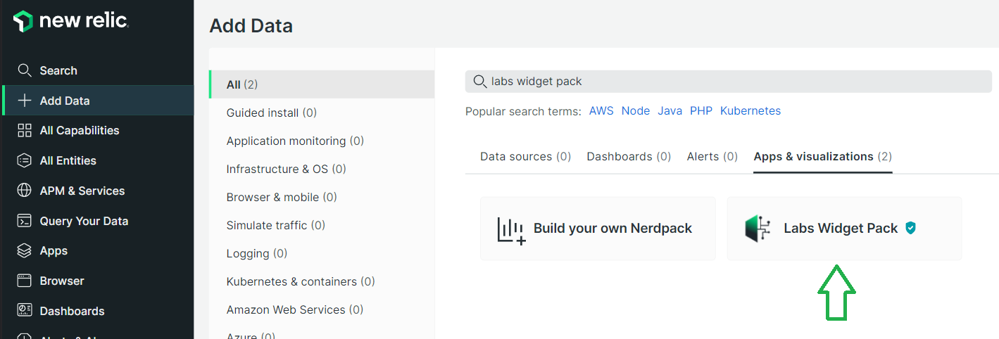

# ChatGPT Visualization Documentation

## Requirements
- Labs Widget Pack deployed and subscribed to your relevant accounts
  - Add Data -> Search: Labs Widget Pack 
    
- OpenAI account
- Organization ID -> https://platform.openai.com/account/org-settings
- API Key -> https://platform.openai.com/account/api-keys

## Getting Started
- Sign up to ChatGPT/OpenAI
- Create an API Key -> https://platform.openai.com/account/api-keys
- If the Labs Widget Pack has been subscribed to your relevant accounts you will then find the widget under Apps -> Custom Visualizations -> ChatGPT Widget

## Configuration
Basic configuration parameters are exposed to tune the ChatGPT responses.

- You are able to select your model, set the max tokens, and the risk via sampling temperature.
- If any further configuration options are required to be exposed a PR can be submitted.

For more information you can read the detailed descriptions as documented by OpenAI here -> https://platform.openai.com/docs/api-reference/completions

