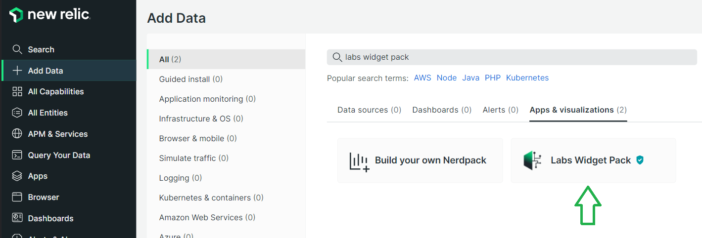

# Map Widget Documentation

## Requirements
- Labs Widget Pack deployed and subscribed to your relevant accounts
  - Add Data -> Search: Labs Widget Pack 
    
- Currently, the Map view is integrated with Map Box - you need a Map Box Access Token to proceed:
  - Go to https://account.mapbox.com/auth/signup/ to sign up and get a Map Box Access Token.

## Configuration
Once the Labs Widget Pack has been subscribed to your relevant accounts you will then find the widget under Apps -> Custom Visualizations -> Map Widget

This vizualization allows you to plot data points stamped with latitude and longitude onto a Map view. 

Once you have a Map Box token, enter the query to isolate the target data.

The query has two mandatory elements: 
1) a NAME that is used as the principal value for the data point on the map. The name must be identified in the query using an alias, with the format `'name:VALUE'`
2) a LATITUDE and LONGITUDE, to allow the data point to be situated correctly on the map. The lat/long can be specified in one of four ways:
    - latitude/longitude attributes in your query: name or alias columns in your query using as lat/long or latitude/longitude (ex. `SELECT latest(myCol) as 'lat' FROM ... / SELECT latest(lat) FROM ... )`
    - coordinates attribute in your query: a single coordinates attribute that includes both lat/long, separated by a comma. You can include a column named coordinates, or alias a column in your query as 'coordinates' (ex. `SELECT latest(coordinates) FROM ... / SELECT latest(myCol) as 'coordinates' FROM ...)`
    - facet clause: Add a facet clause that targets lat/long attributes. The facets must be the first two facets listed, in order of lat and then long. To prevent rounding issues, cast the values to string and set the precision (ex. `...FACET string(myLatCol, precision:5), string(myLongCol, precision:5))`
    - coordinate lookup: if your data does not contain lat or long, you can use the city attribute to perform a coordinate lookup. Include a city column in your query (ex. `'SELECT latest(city) ...' / SELECT lastest(myCol) as 'city')`. This feature is in beta - if your city is not found, please open an issue on the github repo.

The query accepts additional optional elements:
1) ROTATION, which allows you to point the marker in a given direction (for instance, if you are tracking a flight, have your marker point in the direction the plane is flying). The rotation must be identified in the query using an alias, with the format `'rotate:VALUE'`
2) Additional descriptive attributes, to include more information about the marker.

## Example Queries

```
FROM BrowserInteraction SELECT count(*) as 'name:Views', latest(city) WHERE appName = 'WebPortal' SINCE 60 seconds ago FACET asnLatitude, asnLongitude LIMIT MAX

FROM FlightData SELECT latest(flightNo) as 'name:Flight No', latest(track) as 'rotate:track', latest(departure), latest(destination) FACET string(lat, precision: 5), string(lng, precision: 5) SINCE 60 seconds ago LIMIT MAX
```